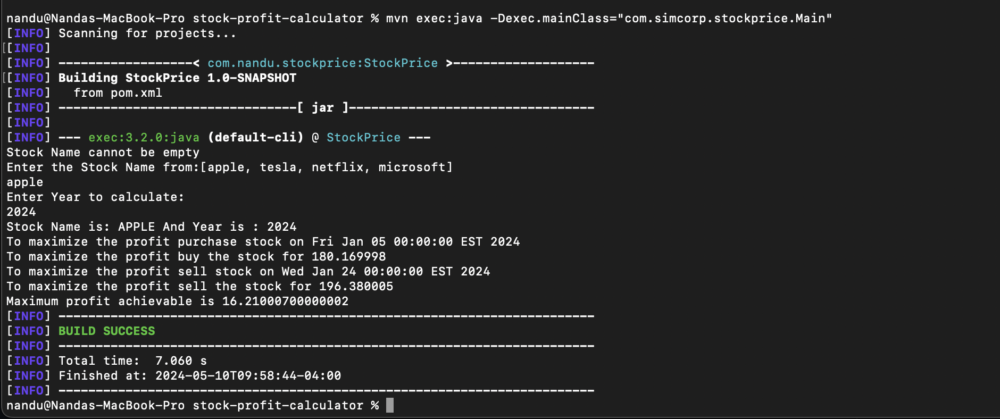

# Stock Profit Calculator

This program calculates the maximum profit that can be earned by buying and selling a stock once within a given year. It reads daily stock prices from a CSV file and provides information on the buy date, buy price, sell date, sell price, and profit.

## Algorithm: Calculate Maximum Profit for Stock

The `maxProfit` function in the `StockProfitCalculator` class calculates the maximum profit that can be obtained by buying and selling a stock within a given year.

### Input Parameters

- `name` (String): Name of the stock.
- `year` (int): Year for which the profit is calculated.

### Output

- `StockProfitResponse`: Object containing the maximum profit stock data, including buy date, buy price, sell date, sell price, and profit.

### Algorithm Description

1. Build the stock price model from the CSV file for the specified stock.
2. If a year is specified, filter out the data from the stock price model for that year; otherwise, use all available data.
3. Iterate through the filtered stock data to identify the buying and selling dates that can yield the maximum profit.
   - Initialize variables for tracking the maximum profit, buy date, sell date, buy price, and sell price.
   - Start the loop from the second day to avoid buying and selling on the same day.
   - For each day, check if selling on that day would result in a higher profit than the current maximum profit.
   - If so, update the maximum profit and the buy/sell dates and prices accordingly.
4. If a profitable buy/sell combination is found, set the values in the response object; otherwise, set the buy price to the lowest available price and sell price to 0, indicating that selling at a profit is not possible in the given year.


# Project Requirements 
## Java Installation
To Install Java, follow the instructions on the [Java Installation Page](https://www.java.com/en/download/apple.jsp)
## Maven Installation

To install Maven, follow the instructions on the [Maven installation page](https://maven.apache.org/install.html).

## Installation

Clone the repository:

```bash
git clone https://github.com/nandu208/stock-profit-calculator.git
```

## Compile the Java Files using Maven

```bash
mvn compile
```
## Sample Screen shot for Successful Compile 


## Run the Main Method or the Program using

```bash
mvn exec:java -Dexec.mainClass="com.simcorp.stockprice.Main"
```

## Sample Screen shot for Successful Execution of Main Method


## Run the test unit cases
```bash
mvn test
```
## Sample Screen shot for Successful Executing test cases


